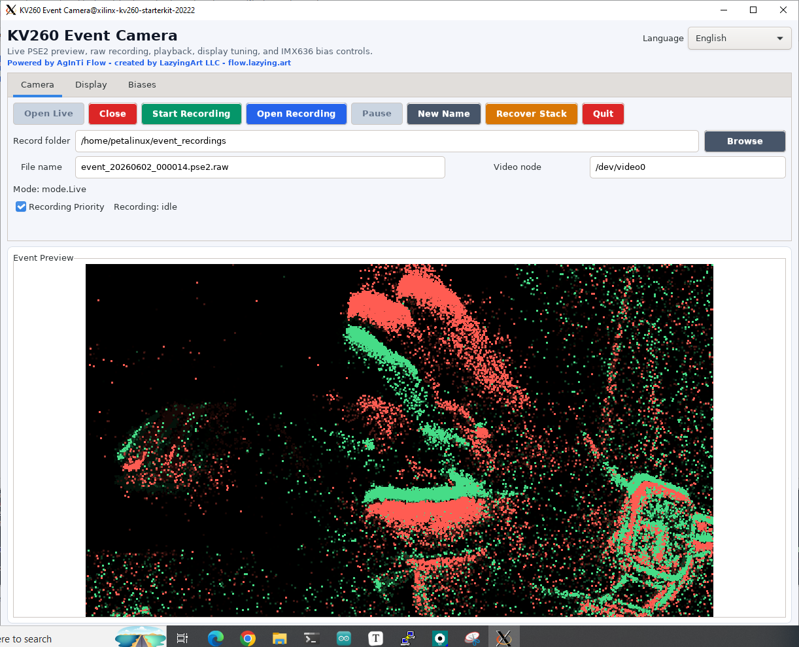
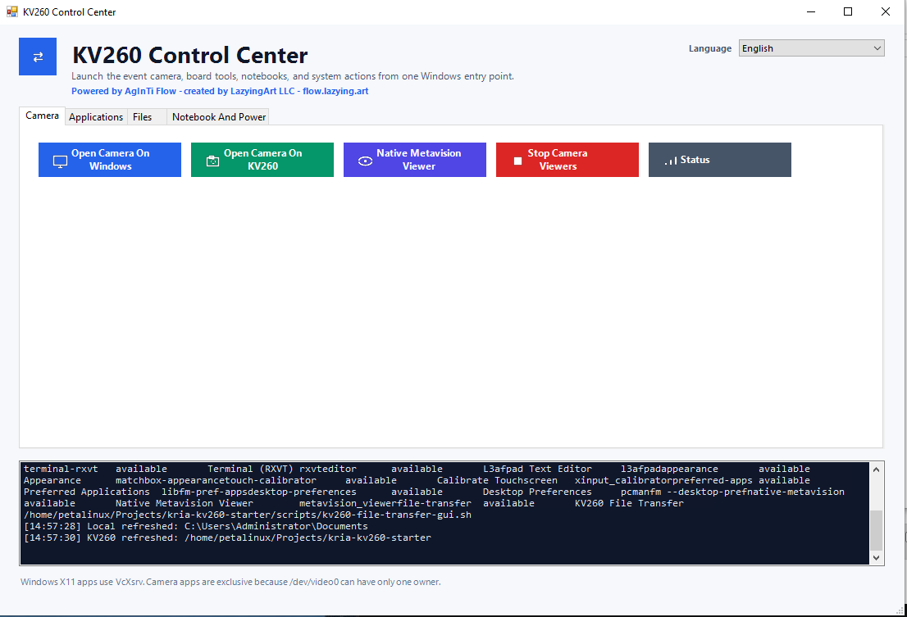
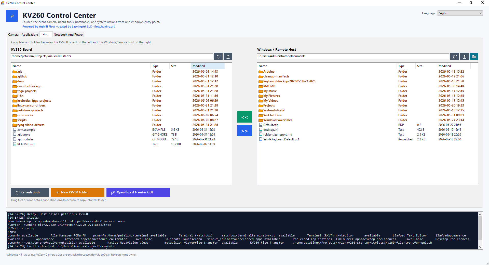

<div align="center">

[English](README.md) · [العربية](i18n/README.ar.md) · [Español](i18n/README.es.md) · [Français](i18n/README.fr.md) · [日本語](i18n/README.ja.md) · [한국어](i18n/README.ko.md) · [Tiếng Việt](i18n/README.vi.md) · [中文 (简体)](i18n/README.zh-Hans.md) · [中文（繁體）](i18n/README.zh-Hant.md) · [Deutsch](i18n/README.de.md) · [Русский](i18n/README.ru.md)

[](https://github.com/lachlanchen/lachlanchen/blob/main/figs/banner.png)

# Kria Metavision Lab

### A GUI-first workspace for using Prophesee event cameras on AMD Kria KV260

<sub>Powered by [AgInTi Flow](https://flow.lazying.art), created by LazyingArt LLC.</sub>

[](https://www.amd.com/en/products/system-on-modules/kria/k26/kv260-vision-starter-kit/event-based-vision-starter-kit.html)
[](https://docs.amd.com/r/en-US/ug1144-petalinux-tools-reference-guide)
[](https://www.prophesee.ai/event-based-metavision-amd-kria-starter-kit/)
[](https://docs.prophesee.ai/amd-kria-starter-kit/)
[](https://flow.lazying.art)
[](https://flow.lazying.art)
[](mailto:lachlan@lazying.art)



<sub>Custom KV260 Event Camera GUI running on the local PetaLinux desktop with live Prophesee event data, recording controls, capture naming, and camera recovery tools.</sub>

<br><br>

<table>
  <tr>
    <td width="50%">
      
    </td>
    <td width="50%">
      
    </td>
  </tr>
  <tr>
    <td>
      <sub>Windows KV260 Control Center v2: one entry point for camera routing, board GUI apps through SSH X11, Jupyter, and power actions.</sub>
    </td>
    <td>
      <sub>File Transfer tab: two-pane host/KV260 browser with bidirectional copy actions for daily board work.</sub>
    </td>
  </tr>
</table>

</div>

## Why This Exists

**Kria Metavision Lab** is a practical workspace for turning the Prophesee AMD Kria KV260 starter kit into a usable event-vision workstation. It keeps the low-level board bring-up, PetaLinux notes, driver references, desktop launchers, and custom camera UI in one place.

It is powered by **AgInTi Flow** ([flow.lazying.art](https://flow.lazying.art)) and created by **LazyingArt LLC**.

The goal is simple: connect the event camera, boot the KV260, open a desktop item, see live events, record data with predictable filenames, and close the viewer cleanly without fighting stale processes or broken launchers.

## The Custom GUI

The center of this repo is a custom KV260 event camera application built for the local PetaLinux desktop:

| Capability | What it does |
| --- | --- |
| Live preview | Opens the V4L2 event stream and renders activity on the HDMI desktop |
| Clean close | Releases the camera device so the next launch works normally |
| Recording | Saves raw event bytes for later analysis |
| Playback | Opens custom `.pse2.raw` recordings directly in the same GUI |
| Display tuning | Adjusts accumulation time, FPS, palette, ON/OFF polarity, dot size, and event trail |
| Bias tuning | Reads and applies common IMX636 V4L2 bias controls from the sensor subdevice |
| Multilingual UI | Supports the same 11-language set as the README and Windows Control Center |
| Metadata | Writes a JSON sidecar with capture information |
| Desktop launcher | Adds a simple menu item for the board desktop |
| Recovery scripts | Clears stale viewer and camera state when the board gets stuck |

The desktop installer creates exactly one visible board Applications entry for each useful GUI:

| Launcher | Behavior |
| --- | --- |
| `KV260 Event Camera` | Opens the custom GUI with close, record, folder, filename, and recovery controls |
| `Metavision Viewer` | Toggles the native Prophesee viewer for SDK smoke tests |
| `KV260 File Transfer` | Opens the two-pane file transfer GUI |

The installer removes stale duplicates from Desktop folders and per-user application folders. If Matchbox gets stuck with a busy cursor, use the recovery note in `references/kv260-desktop-stall-recovery.md`.

By default, generated event recordings stay outside the repo in `/home/petalinux/event_recordings`; the legacy raw acquisition loop uses `/home/petalinux/event-visual`.

Windows also has a single `KV260 Control Center` launcher for the camera, common board GUI apps, Jupyter, and board power actions:

| Action | Behavior |
| --- | --- |
| `Open On Windows` | Stops the board GUI first, then opens the custom GUI on Windows through SSH X forwarding |
| `Open On KV260 Display` | Stops the Windows X11 GUI first, then opens or raises the custom GUI on the KV260 HDMI desktop |
| `Stop All Viewers` | Releases `/dev/video0` cleanly |
| `Applications` tab | Opens PCManFM, terminals, L3afpad, Appearance, touchscreen calibration, preferred apps, desktop preferences, and native Metavision through SSH X11 |
| `Files` tab | Two-pane Windows/KV260 file browser with multi-select upload, download, and drag/drop SCP transfers |
| `Open Jupyter Notebook` | Starts Jupyter on the KV260, opens an SSH tunnel, and opens the Windows browser |

Both the board viewer and Windows Control Center support English, Arabic, Spanish, French, Japanese, Korean, Vietnamese, Simplified Chinese, Traditional Chinese, German, and Russian. The board viewer saves its language preference in `/home/petalinux/.config/kv260-event-camera-app.json`; the Windows Control Center saves it in `%APPDATA%\KV260ControlCenter\settings.json`.

For scripted experiments, the repo also provides a headless recording API. This is the recommended path when Windows controls an Arduino light source and needs to trigger KV260 event recording without using the GUI:

| API path | Behavior |
| --- | --- |
| `scripts/kv260-event-camera-api.sh start` | Starts a LAN HTTP API on the KV260 |
| `POST /api/v1/record/start` | Starts raw PSE2 recording with preview disabled |
| `POST /api/v1/record/stop` | Stops recording, flushes the writer, and returns file paths |
| `GET /api/v1/recordings/download` | Downloads `.pse2.raw` and `.json` sidecar files |
| `scripts/windows/KV260EventExperimentClient.py` | Windows client for Arduino light commands, recording trigger, and download |

The API records through the same writer as the GUI, but disables preview and event counting by default so experiment recording gets priority.

Main files:

```text
scripts/kv260-event-camera-app.py
scripts/kv260-event-camera-app.sh
scripts/kv260-event-camera-switch.sh
scripts/kv260-event-camera-x11.sh
scripts/kv260-event-camera-api.py
scripts/kv260-event-camera-api.sh
scripts/kv260-remote-gui-app.sh
scripts/kv260-jupyter-notebook.sh
scripts/kv260-file-transfer-gui.py
scripts/kv260-file-transfer-gui.sh
scripts/windows/Open-KV260EventCamera.ps1
scripts/windows/KV260EventExperimentClient.py
scripts/kv260-metavision-viewer-toggle.sh
scripts/kv260-install-prophesee-desktop.sh
scripts/kv260-launch-desktop-viewer.sh
references/kv260-event-camera-app.md
references/kv260-remote-recording-api.md
```

## What Is Inside

| Area | Purpose |
| --- | --- |
| `scripts/` | Viewer, launcher, camera scan, desktop, RDP, and recovery helpers |
| `references/` | Research notes, setup logs, Prophesee links, GUI notes, and deployment docs |
| `fpga-projects/` | Prophesee FPGA project submodule for KV260 |
| `petalinux-projects/` | PetaLinux project submodule with the lab GUI/RDP rootfs branch |
| `linux-sensor-drivers/` | IMX636 and GenX320 Linux sensor driver submodule |
| `zynq-video-drivers/` | Zynq video pipeline driver submodule used by the kit |
| `event-vitisai-app/` | LogicTronix / Prophesee / AMD Vitis AI event demo submodule |
| `i18n/` | Multilingual README pages |

## Hardware And Runtime

| Layer | Current target |
| --- | --- |
| Board | AMD Kria KV260 Vision AI Starter Kit |
| Event sensor | Prophesee IMX636 or GenX320 module |
| OS | Prophesee / AMD PetaLinux 2022.2 |
| Camera API | V4L2 and media controller |
| Desktop | X11 + Matchbox on local HDMI |
| Viewer path | Custom GTK viewer plus Metavision command-line tools |

## Quick Start

On the KV260:

```sh
cd ~/Projects/kria-kv260-starter
KV260_SUDO_PASSWORD=<password> ./scripts/kv260-full-setup.sh
```

Dry-run first if you want to inspect the operations:

```sh
./scripts/kv260-full-setup.sh --dry-run
```

Install the optional Windows control center over LAN SSH:

```sh
KV260_SUDO_PASSWORD=<password> ./scripts/kv260-full-setup.sh \
  --windows-host <windows-ip> \
  --windows-user <windows-user> \
  --windows-key /home/petalinux/.ssh/id_dropbear_rsa \
  --windows-board-alias petalinux-kv260
```

Open or stop the custom viewer:

```sh
./scripts/kv260-event-camera-switch.sh --board
./scripts/kv260-event-camera-switch.sh --stop-all
```

Check and recover the camera stack:

```sh
./scripts/kv260-camera-viewer.sh --status
./scripts/kv260-camera-viewer.sh --stop
./scripts/kv260-camera-deep-scan.sh --quick
./scripts/kv260-recover-event-viewer.sh
```

Full setup details are in:

```text
references/kv260-full-setup.md
```

## Research Notes

The repo keeps both successful paths and blocked paths, because embedded vision bring-up depends on knowing what actually happened on the board.

Useful references:

```text
references/kv260-prophesee-resources.md
references/kv260-event-camera-app.md
references/kv260-remote-recording-api.md
references/kv260-arduino-cli-control-api.md
references/kv260-full-setup.md
references/kv260-file-transfer.md
references/kv260-desktop-stall-recovery.md
references/kv260-windows-shortcuts-x11.md
references/kv260-native-metavision-viewer-close-behavior.md
references/kv260-openeb-custom-viewer-research.md
references/kv260-camera-viewer.md
references/kv260-event-visual-gui-launch.md
references/gui-petalinux.md
references/upstream-submodules.md
references/kv260-disk-usage.md
references/kv260-expand-rootfs-sd.md
references/kv260-rdp-research.md
references/kv260-ias1-j8-frame-camera.md
references/github-repo-metadata.md
```

## GitHub Metadata

Suggested repository:

```text
lachlanchen/kria-metavision-lab
```

Homepage:

```text
https://flow.lazying.art
```

Recommended About:

```text
GUI-first AMD Kria KV260 + Prophesee Metavision lab for event-camera bring-up, custom recording/viewing, PetaLinux tooling, and embedded vision experiments.
```

Recommended topics are documented in:

```text
references/github-repo-metadata.md
```

## Public Upload Safety

This README is public-facing. Keep local passwords, private IP addresses, Prophesee account downloads, and machine-specific access notes out of the public repository history.

Before publishing:

```sh
git status --short
git grep -nE 'pass(word|wd)|token|secret|Administrator|192[.]168[.]|[m]dmd|lachen[@]'
```

The local `.env` is a machine manifest, not a public configuration file.

## Upstream Credit

This workspace builds around the AMD Kria KV260 and Prophesee Metavision ecosystem. Please check each upstream repository and vendor package for its own license before redistributing code, images, SDK archives, or board support files.
