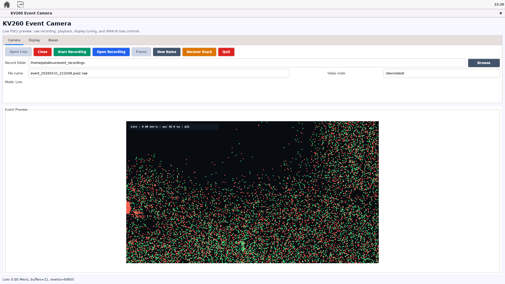

<div align="center">

[English](README.md) · [العربية](i18n/README.ar.md) · [Español](i18n/README.es.md) · [Français](i18n/README.fr.md) · [日本語](i18n/README.ja.md) · [한국어](i18n/README.ko.md) · [Tiếng Việt](i18n/README.vi.md) · [中文 (简体)](i18n/README.zh-Hans.md) · [中文（繁體）](i18n/README.zh-Hant.md) · [Deutsch](i18n/README.de.md) · [Русский](i18n/README.ru.md)

[](https://github.com/lachlanchen/lachlanchen/blob/main/figs/banner.png)

# Kria Metavision Lab

### A GUI-first workspace for using Prophesee event cameras on AMD Kria KV260

[](https://www.amd.com/en/products/system-on-modules/kria/k26/kv260-vision-starter-kit/event-based-vision-starter-kit.html)
[](https://docs.amd.com/r/en-US/ug1144-petalinux-tools-reference-guide)
[](https://www.prophesee.ai/event-based-metavision-amd-kria-starter-kit/)
[](https://docs.prophesee.ai/amd-kria-starter-kit/)
[](https://flow.lazying.art)
[](mailto:lachlan@lazying.art)



<sub>Custom KV260 Event Camera GUI running on the local PetaLinux desktop with live Prophesee event data, recording controls, capture naming, and camera recovery tools.</sub>

</div>

## Why This Exists

**Kria Metavision Lab** is a practical workspace for turning the Prophesee AMD Kria KV260 starter kit into a usable event-vision workstation. It keeps the low-level board bring-up, PetaLinux notes, driver references, desktop launchers, and custom camera UI in one place.

The goal is simple: connect the event camera, boot the KV260, open a desktop item, see live events, record data with predictable filenames, and close the viewer cleanly without fighting stale processes or broken launchers.

## The Custom GUI

The center of this repo is a custom KV260 event camera application built for the local PetaLinux desktop:

| Capability | What it does |
| --- | --- |
| Live preview | Opens the V4L2 event stream and renders activity on the HDMI desktop |
| Clean close | Releases the camera device so the next launch works normally |
| Recording | Saves raw event bytes for later analysis |
| Metadata | Writes a JSON sidecar with capture information |
| Desktop launcher | Adds a simple menu item for the board desktop |
| Recovery scripts | Clears stale viewer and camera state when the board gets stuck |

The desktop installer creates two launchers:

| Launcher | Behavior |
| --- | --- |
| `KV260 Event Camera` | Opens the custom GUI with close, record, folder, filename, and recovery controls |
| `Metavision Viewer` | Toggles the native Prophesee `metavision_viewer`: click once to open, click again to close |

The stable desktop setup keeps only those two system Applications entries and removes duplicate Desktop shortcuts. If Matchbox gets stuck with a busy cursor, use the recovery note in `references/kv260-desktop-stall-recovery.md`.

Main files:

```text
scripts/kv260-event-camera-app.py
scripts/kv260-event-camera-app.sh
scripts/kv260-metavision-viewer-toggle.sh
scripts/kv260-install-prophesee-desktop.sh
scripts/kv260-launch-desktop-viewer.sh
references/kv260-event-camera-app.md
```

## What Is Inside

| Area | Purpose |
| --- | --- |
| `scripts/` | Viewer, launcher, camera scan, desktop, RDP, and recovery helpers |
| `references/` | Research notes, setup logs, Prophesee links, GUI notes, and deployment docs |
| `fpga-projects/` | Prophesee FPGA project submodule for KV260 |
| `petalinux-projects/` | PetaLinux project submodule with the lab GUI/RDP rootfs branch |
| `linux-sensor-drivers/` | IMX636 and GenX320 Linux sensor driver submodule |
| `zynq-video-drivers/` | Zynq video pipeline driver submodule used by the kit |
| `event-vitisai-app/` | LogicTronix / Prophesee / AMD Vitis AI event demo submodule |
| `i18n/` | Multilingual README pages |

## Hardware And Runtime

| Layer | Current target |
| --- | --- |
| Board | AMD Kria KV260 Vision AI Starter Kit |
| Event sensor | Prophesee IMX636 or GenX320 module |
| OS | Prophesee / AMD PetaLinux 2022.2 |
| Camera API | V4L2 and media controller |
| Desktop | X11 + Matchbox on local HDMI |
| Viewer path | Custom GTK viewer plus Metavision command-line tools |

## Quick Start

On the KV260:

```sh
cd ~/Projects/kria-metavision-lab
./scripts/kv260-camera-viewer.sh --list
./scripts/kv260-camera-viewer.sh --start
```

Install or refresh the desktop item:

```sh
./scripts/kv260-install-prophesee-desktop.sh --install
./scripts/kv260-launch-desktop-viewer.sh
```

Check and recover the camera stack:

```sh
./scripts/kv260-camera-viewer.sh --status
./scripts/kv260-camera-viewer.sh --stop
./scripts/kv260-camera-deep-scan.sh --quick
./scripts/kv260-recover-event-viewer.sh
```

## Research Notes

The repo keeps both successful paths and blocked paths, because embedded vision bring-up depends on knowing what actually happened on the board.

Useful references:

```text
references/kv260-prophesee-resources.md
references/kv260-event-camera-app.md
references/kv260-desktop-stall-recovery.md
references/kv260-camera-viewer.md
references/kv260-event-visual-gui-launch.md
references/gui-petalinux.md
references/upstream-submodules.md
references/kv260-rdp-research.md
references/kv260-ias1-j8-frame-camera.md
references/github-repo-metadata.md
```

## GitHub Metadata

Suggested repository:

```text
lachlanchen/kria-metavision-lab
```

Homepage:

```text
https://flow.lazying.art
```

Recommended About:

```text
GUI-first AMD Kria KV260 + Prophesee Metavision lab for event-camera bring-up, custom recording/viewing, PetaLinux tooling, and embedded vision experiments.
```

Recommended topics are documented in:

```text
references/github-repo-metadata.md
```

## Public Upload Safety

This README is public-facing. Keep local passwords, private IP addresses, Prophesee account downloads, and machine-specific access notes out of the public repository history.

Before publishing:

```sh
git status --short
git grep -nE 'pass(word|wd)|token|secret|Administrator|192[.]168[.]|[m]dmd|lachen[@]'
```

The local `.env` is a machine manifest, not a public configuration file.

## Upstream Credit

This workspace builds around the AMD Kria KV260 and Prophesee Metavision ecosystem. Please check each upstream repository and vendor package for its own license before redistributing code, images, SDK archives, or board support files.
